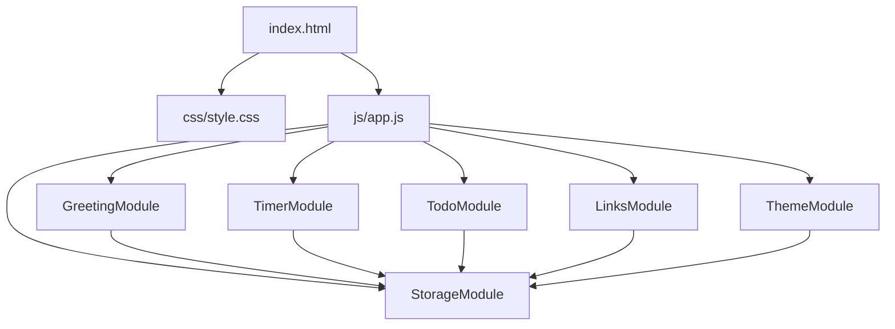
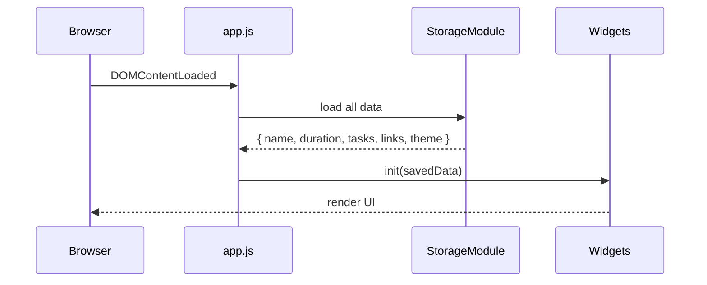

# Design Document

## Overview

Personal Dashboard adalah single-page web app yang berjalan sepenuhnya di browser. Tidak ada backend, tidak ada framework — hanya HTML, CSS, dan Vanilla JavaScript. Semua state persisten disimpan di `localStorage`. Aplikasi terdiri dari empat widget utama: Greeting, Focus Timer, To-Do List, dan Quick Links, ditambah toggle Light/Dark mode.

Karena tidak ada build step, seluruh kode ditulis dalam satu file `index.html`, satu file `css/style.css`, dan satu file `js/app.js`.

---

## Architecture

Arsitektur mengikuti pola **Module Pattern** berbasis Vanilla JS. Setiap widget direpresentasikan sebagai modul objek dengan metode `init()`, `render()`, dan handler-nya sendiri. Tidak ada state global tunggal — setiap modul mengelola state-nya sendiri dan berkomunikasi dengan `localStorage` secara langsung.



**Alur inisialisasi:**



---

## Components and Interfaces

### StorageModule

Bertanggung jawab atas semua operasi `localStorage`. Menyediakan interface terpusat sehingga modul lain tidak perlu tahu detail key storage.

```js
StorageModule = {
  get(key, fallback),       // parse JSON, return fallback jika error/null
  set(key, value),          // JSON.stringify lalu simpan
  KEYS: {
    NAME, DURATION, TASKS, LINKS, THEME
  }
}
```

### ThemeModule

```js
ThemeModule = {
  init(),          // baca storage atau prefers-color-scheme, terapkan
  toggle(),        // ganti tema, simpan ke storage
  apply(theme)     // set data-theme attribute pada <html>
}
```

### GreetingModule

```js
GreetingModule = {
  init(savedName),   // render awal, mulai interval 1 menit
  setName(name),     // simpan nama, re-render greeting
  getGreeting(hour), // pure function: hour → string greeting
  formatTime(date),  // pure function: Date → "HH:MM"
  formatDate(date),  // pure function: Date → "Day, DD Month YYYY"
}
```

### TimerModule

```js
TimerModule = {
  init(savedDuration),  // render awal dengan durasi tersimpan
  start(),              // mulai countdown, update kontrol
  stop(),               // pause countdown
  reset(),              // kembalikan ke durasi terkonfigurasi
  setDuration(minutes), // validasi & simpan durasi baru
  tick(),               // dipanggil setiap detik oleh setInterval
  notify(),             // tampilkan notifikasi saat 00:00
  formatTime(seconds),  // pure function: seconds → "MM:SS"
}
```

### TodoModule

```js
TodoModule = {
  init(savedTasks),         // render list dari storage
  addTask(title),           // validasi, buat task baru, simpan
  toggleTask(id),           // flip status complete/incomplete, simpan
  editTask(id, newTitle),   // validasi, update title, simpan
  deleteTask(id),           // hapus dari array, simpan
  render(),                 // re-render seluruh list ke DOM
  save(),                   // tulis state ke StorageModule
}
```

### LinksModule

```js
LinksModule = {
  init(savedLinks),         // render links dari storage
  addLink(label, url),      // validasi label & URL, tambah, simpan
  deleteLink(id),           // hapus dari array, simpan
  render(),                 // re-render seluruh panel ke DOM
  isValidUrl(url),          // pure function: string → boolean
  save(),                   // tulis state ke StorageModule
}
```

---

## Data Models

Semua data disimpan sebagai JSON string di `localStorage`.

### Name

```js
// localStorage key: "pd_name"
// Type: string | null
"Alex"
```

### Timer Duration

```js
// localStorage key: "pd_duration"
// Type: number (whole minutes, 1–120)
25
```

### Task

```js
// localStorage key: "pd_tasks"
// Type: Task[]
{
  id: string,        // crypto.randomUUID() atau Date.now().toString()
  title: string,     // non-empty
  completed: boolean // default: false
}
```

### Link

```js
// localStorage key: "pd_links"
// Type: Link[]
{
  id: string,   // crypto.randomUUID() atau Date.now().toString()
  label: string, // non-empty
  url: string    // valid URL
}
```

### Theme

```js
// localStorage key: "pd_theme"
// Type: "light" | "dark" | null
"dark"
```

---

## Correctness Properties

*A property is a characteristic or behavior that should hold true across all valid executions of a system — essentially, a formal statement about what the system should do. Properties serve as the bridge between human-readable specifications and machine-verifiable correctness guarantees.*


### Property 1: Greeting time format

*For any* valid `Date` object, `formatTime(date)` SHALL return a string matching the pattern `HH:MM` where HH is in [00–23] and MM is in [00–59].

**Validates: Requirements 1.1**

---

### Property 2: Greeting date format

*For any* valid `Date` object, `formatDate(date)` SHALL return a string that contains a valid day-of-week name, a valid month name, and a 4-digit year.

**Validates: Requirements 1.2**

---

### Property 3: Greeting message by hour

*For any* integer hour in [0–23], `getGreeting(hour)` SHALL return exactly one of "Good morning", "Good afternoon", "Good evening", or "Good night", consistent with the time ranges defined in Requirements 1.3–1.6.

**Validates: Requirements 1.3, 1.4, 1.5, 1.6**

---

### Property 4: Name in greeting

*For any* non-empty string `name`, after calling `setName(name)`, the rendered greeting text SHALL contain `name` as a suffix.

**Validates: Requirements 2.2**

---

### Property 5: Name storage round-trip

*For any* string `name`, calling `StorageModule.set(KEYS.NAME, name)` then `StorageModule.get(KEYS.NAME, null)` SHALL return the same value.

**Validates: Requirements 2.3**

---

### Property 6: Timer display format

*For any* integer `seconds` in [0–7200], `formatTime(seconds)` SHALL return a string matching the pattern `MM:SS` where both parts are zero-padded and values are in valid range.

**Validates: Requirements 3.1**

---

### Property 7: Timer reset restores configured duration

*For any* configured duration and any elapsed time, calling `reset()` SHALL result in the displayed remaining time equaling the configured duration.

**Validates: Requirements 3.4**

---

### Property 8: Timer control state invariant

*For any* timer state (running or stopped/reset), the start, stop, and duration-input controls SHALL reflect that state: when running — start disabled, stop enabled, duration input disabled; when stopped/reset — start enabled, stop disabled, duration input enabled.

**Validates: Requirements 3.6, 3.7, 4.6**

---

### Property 9: Valid duration updates display and persists

*For any* integer `n` in [1–120], calling `setDuration(n)` SHALL update the displayed time to `n * 60` seconds formatted as MM:SS, and `StorageModule.get(KEYS.DURATION)` SHALL return `n`.

**Validates: Requirements 4.2, 4.3**

---

### Property 10: Invalid duration is rejected

*For any* integer `n` outside [1–120], calling `setDuration(n)` SHALL leave the configured duration and displayed time unchanged.

**Validates: Requirements 4.5**

---

### Property 11: Task addition

*For any* non-empty string `title`, calling `addTask(title)` SHALL add exactly one task to the list with `completed = false` and `title` equal to the input.

**Validates: Requirements 5.2**

---

### Property 12: Task completion toggle round-trip

*For any* task, calling `toggleTask(id)` twice SHALL result in the task having the same `completed` status as before the first toggle.

**Validates: Requirements 5.4, 5.5**

---

### Property 13: Task edit

*For any* task and any non-empty string `newTitle`, calling `editTask(id, newTitle)` SHALL update the task's title to `newTitle`.

**Validates: Requirements 5.7**

---

### Property 14: Task deletion

*For any* task list and any task `id` in that list, calling `deleteTask(id)` SHALL result in no task with that `id` remaining in the list.

**Validates: Requirements 5.9**

---

### Property 15: Task list storage round-trip

*For any* sequence of task mutations (add/toggle/edit/delete), after each mutation `StorageModule.get(KEYS.TASKS)` SHALL return an array equal to the current in-memory task list.

**Validates: Requirements 5.10**

---

### Property 16: Link addition

*For any* non-empty string `label` and valid URL string `url`, calling `addLink(label, url)` SHALL add exactly one link to the panel that opens `url` in a new tab.

**Validates: Requirements 6.2**

---

### Property 17: Invalid link is rejected

*For any* input where `label` is empty or `url` fails URL validation, calling `addLink(label, url)` SHALL leave the link list unchanged.

**Validates: Requirements 6.3**

---

### Property 18: Link deletion

*For any* link list and any link `id` in that list, calling `deleteLink(id)` SHALL result in no link with that `id` remaining in the list.

**Validates: Requirements 6.4**

---

### Property 19: Link list storage round-trip

*For any* sequence of link mutations (add/delete), after each mutation `StorageModule.get(KEYS.LINKS)` SHALL return an array equal to the current in-memory link list.

**Validates: Requirements 6.5**

---

### Property 20: Theme storage round-trip

*For any* theme value ("light" or "dark"), after calling `ThemeModule.toggle()`, `StorageModule.get(KEYS.THEME)` SHALL return the currently applied theme.

**Validates: Requirements 7.3**

---

### Property 21: Full state restoration on load

*For any* valid saved state (name, duration, tasks, links, theme), after writing that state to storage and calling each module's `init()`, all modules SHALL reflect the saved values.

**Validates: Requirements 8.1**

---

## Error Handling

### StorageModule

- `get(key, fallback)` wraps `JSON.parse` in try/catch. Jika `localStorage` tidak tersedia atau data corrupt, kembalikan `fallback`.
- `set(key, value)` wraps `localStorage.setItem` dalam try/catch. Jika gagal (misal storage penuh), log warning ke console — app tetap berjalan dengan in-memory state.

### GreetingModule

- Jika `localStorage` tidak ada nama tersimpan, tampilkan greeting tanpa suffix nama.
- Input nama yang hanya berisi whitespace diperlakukan sebagai kosong.

### TimerModule

- Durasi di luar range [1–120] ditolak; durasi sebelumnya dipertahankan.
- Jika `localStorage` mengembalikan nilai non-integer atau NaN untuk durasi, fallback ke 25 menit.

### TodoModule

- Task title kosong atau hanya whitespace ditolak; tampilkan pesan validasi inline.
- Edit dengan title kosong dibatalkan; title asli dipertahankan.
- Jika data tasks dari storage bukan array valid, fallback ke array kosong.

### LinksModule

- Label kosong atau URL tidak valid ditolak; tampilkan pesan validasi inline.
- URL divalidasi menggunakan `new URL(input)` dalam try/catch — jika throw, URL dianggap tidak valid.
- Jika data links dari storage bukan array valid, fallback ke array kosong.

### ThemeModule

- Jika storage tidak ada preferensi tersimpan, gunakan `window.matchMedia('(prefers-color-scheme: dark)')`.
- Jika media query tidak didukung, fallback ke tema light.

---

## Testing Strategy

Karena proyek ini adalah Vanilla JS tanpa build setup, testing dilakukan dengan library yang bisa di-load langsung via CDN atau sebagai file lokal.

**Library yang digunakan:**
- Unit & property tests: [fast-check](https://fast-check.dev/) (property-based testing untuk JavaScript)
- Test runner: file HTML terpisah (`test/index.html`) yang menjalankan test di browser, atau Node.js dengan `node --experimental-vm-modules`

**Pendekatan dual testing:**

1. **Unit tests** — untuk contoh spesifik, edge case, dan kondisi error:
   - Default timer duration (25 menit)
   - Greeting tanpa nama tersimpan
   - Malformed storage data → fallback ke default
   - UI structural checks (input exists, button exists)

2. **Property tests** — untuk properti universal (Properties 1–21 di atas):
   - Setiap property test dikonfigurasi minimum **100 iterasi**
   - Setiap test diberi tag komentar: `// Feature: personal-dashboard, Property N: <property_text>`

**Contoh struktur test:**

```js
// Feature: personal-dashboard, Property 3: Greeting message by hour
fc.assert(
  fc.property(fc.integer({ min: 0, max: 23 }), (hour) => {
    const greeting = GreetingModule.getGreeting(hour);
    if (hour >= 5 && hour <= 11) return greeting === "Good morning";
    if (hour >= 12 && hour <= 17) return greeting === "Good afternoon";
    if (hour >= 18 && hour <= 21) return greeting === "Good evening";
    return greeting === "Good night"; // 22–23 dan 0–4
  }),
  { numRuns: 100 }
);
```

**Fokus unit test (hindari duplikasi dengan property tests):**
- Contoh konkret yang mendemonstrasikan perilaku benar
- Integration point antar modul (misal: addTask → save → load)
- Edge case dan kondisi error yang tidak tercakup generator

**Modul yang diprioritaskan untuk testing:**
- `StorageModule.get/set` — fondasi semua persistensi
- `GreetingModule.getGreeting`, `formatTime`, `formatDate` — pure functions
- `TimerModule.formatTime`, `setDuration` — pure functions + validasi
- `TodoModule.addTask`, `toggleTask`, `editTask`, `deleteTask` — business logic
- `LinksModule.addLink`, `isValidUrl`, `deleteLink` — business logic + validasi
